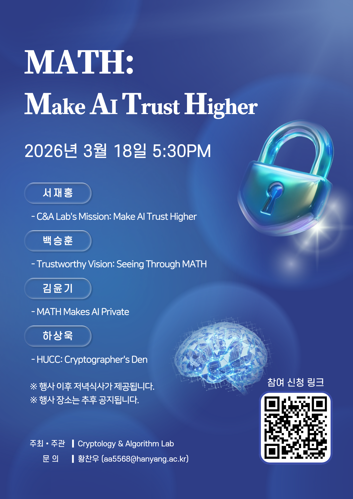

# About us

We are Cryptology & Algorithm Lab and our leader is Professor [Jae Hong Seo](https://sites.google.com/site/jhsbhs/). Our main research interests are in cryptography especially zero-knowledge proof. Besides cryptography, we're interested in artificial intelligence using deep learning such as face recognition and speaker recognition.

## Annual News

  <article class="cna-card cna-cat-talk">
    <header class="cna-card-head">
      Seminar
      <time class="cna-card-meta">May 20, 2026</time>
    </header>
    

      
Prof. Yongha Son from Sungshin Women’s University will visit the C&amp;A Lab and give a lecture.

      <ul>
        <li>Date &amp; Place: 01:30 PM, May 21 / Natural Science Building 102</li>
        <li>Title: Private Set Intersection</li>
      </ul>
    

  </article>

  <article class="cna-card cna-cat-people">
    <header class="cna-card-head">
      Member
      <time class="cna-card-meta">May 4, 2026</time>
    </header>
    

      Two undergraduate students <b>Hyeonmin Jang</b> and <b>Ingeun Yun</b> joined our Cryptology &amp; Algorithm Lab. We are delighted to welcome them.
    

  </article>

  <article class="cna-card cna-cat-talk">
    <header class="cna-card-head">
      Seminar
      <time class="cna-card-meta">Apr 20, 2026</time>
    </header>
    

      
Dr. Keewoo Lee from the Ethereum Foundation visited the C&amp;A Lab and gave a lecture.

      <ul>
        <li>Date &amp; Place: 01:00 PM, Apr 20 / Natural Science Building 702</li>
        <li>Title: Private Information Retrieval</li>
      </ul>
    

  </article>

  <article class="cna-card cna-cat-paper">
    <header class="cna-card-head">
      Journal
      <time class="cna-card-meta">Apr 13, 2026</time>
    </header>
    

      
Accepted for publication at <b>IEEE Access</b>.

      
<b>Minsu Kim&dagger;</b>, <b>Seunghun Paik&dagger;</b>, <b>Seongae Baek</b>, <b>Sangyoon Shin</b>, <b>Sunpill Kim</b>, and <b>Jae Hong Seo*</b> 
      <i>SilverMask: Face Template Protection with Fine-Grained Noise Correction</i>

    

  </article>

  <article class="cna-card cna-cat-talk">
    <header class="cna-card-head">
      Conference
      <time class="cna-card-meta">Apr 10, 2026</time>
    </header>
    

      
Accepted for publication at <b>ACM CCS 2026</b>.

      
<b>Seunghun Paik&dagger;</b>, <b>Sunpill Kim&dagger;</b>, <b>Chanwoo Hwang</b>, and <b>Jae Hong Seo*</b> 
      <i>Casting the Net! Revisiting MasterFace Impersonation Attacks</i>

    

  </article>

  <article class="cna-card cna-cat-event">
    <header class="cna-card-head">
      Program
      <time class="cna-card-meta">Apr 9, 2026</time>
    </header>
    

      <b>Yunki Kim</b> has been selected for the National Cryptographic Expert Training Program (NACET) 12th cohort.
    

  </article>

  <article class="cna-card cna-cat-award">
    <header class="cna-card-head">
      Award
      <time class="cna-card-meta">Apr 3, 2026</time>
    </header>
    

      
Selected <b>Outstanding Paper</b> at Hanyang University.

      
<b>Seunghun Paik</b>, <b>Chanwoo Hwang</b>, <b>Sunpill Kim,</b> and <b>Jae Hong Seo*</b> 
      <i>On the Reversibility of Locality-Sensitive Hashing-Based Biometric Template Protections</i> 
      <b>IEEE Transactions on Dependable and Secure Computing</b>

    

  </article>

  <article class="cna-card cna-cat-event">
    <header class="cna-card-head">
      Workshop
      <time class="cna-card-meta">Mar 18, 2026</time>
    </header>
    

      
C&amp;A Lab hosted the “MATH: Make AI Trust Higher” workshop at Hanyang University.

      

        
Poster

        
      

    

  </article>

  <article class="cna-card cna-cat-award">
    <header class="cna-card-head">
      Award
      <time class="cna-card-meta">Feb 5, 2026</time>
    </header>
    

      
Sunpill Kim will receive the <b>Outstanding Ph.D. Dissertation Award</b> from Hanyang University.

      
<b>Sunpill Kim</b> 
      <i>Score-Based Non-Adaptive Attack Against Face Recognition Systems</i>

    

  </article>

  <article class="cna-card cna-cat-paper">
    <header class="cna-card-head">
      Journal
      <time class="cna-card-meta">Jan 13, 2026</time>
    </header>
    

      
Accepted for publication at <b>IEEE Access</b>.

      
<b>Hyeonbum Lee</b>, <b>Seunghun Paik</b>, <b>Hyunjung Son</b>, and <b>Jae Hong Seo*</b> 
      <i>Cougar: Cubic Root Verifier Inner Product Argument under Discrete Logarithm Assumption</i>

    

  </article>

  <article class="cna-card cna-cat-people">
    <header class="cna-card-head">
      Member
      <time class="cna-card-meta">Jan 5, 2026</time>
    </header>
    

      <b>Insoo Kim</b> (undergraduate student) joined Cryptology &amp; Algorithm Lab, and we are pleased to welcome him to our Lab.
    

  </article>

## Seminar

  

    <h3>2026 · Spring / Summer Seminar</h3>
    4 sessions
    <svg class="cna-year-chevron" viewBox="0 0 24 24" fill="none" stroke="currentColor" stroke-width="2.4"><path d="M6 9l6 6 6-6"/></svg>
  

  

    

      <article class="cna-card cna-cat-talk">
        <header class="cna-card-head">
          Apr 24 · 10:00–12:00
          <a class="cna-card-meta" href="https://drive.google.com/file/d/1sM5iu_cBU5L2uL7pHeDBTwneX_Bg4jXQ/view?usp=sharing" target="_blank" rel="noopener">Slides ↗</a>
        </header>
        

          <b>Deep Neural Cryptography</b> 
          Seunghun Paik · Natural Building 702
        

      </article>

      <article class="cna-card cna-cat-talk">
        <header class="cna-card-head">
          May 8 · 10:00–12:00
          <a class="cna-card-meta" href="https://drive.google.com/file/d/13wY5T6epOOkcCL5_ssNvwXij1vV_PnOG/view?usp=drive_link" target="_blank" rel="noopener">Slides ↗</a>
        </header>
        

          <b>Towards Deep Conversational Recommendations</b> 
          Changjin Kim · Natural Building 702
        

      </article>

      <article class="cna-card cna-cat-talk">
        <header class="cna-card-head">
          May 15 · 10:00–12:00
          <a class="cna-card-meta" href="https://drive.google.com/file/d/1WkHs5Uy_McSIr7bRCPyiTmF3gE1I-wVC/view" target="_blank" rel="noopener">Slides ↗</a>
        </header>
        

          <b>Denoising Diffusion Implicit Models</b> 
          Minsu Kim · Natural Building 702
        

      </article>

      <article class="cna-card cna-cat-talk">
        <header class="cna-card-head">
          May 22 · 10:00–12:00
          <a class="cna-card-meta" href="https://drive.google.com/file/d/1Wh3zIBRhfLKzUfu63uv_8mjjPbg0zH-n/view?usp=drive_link" target="_blank" rel="noopener">Slides ↗</a>
        </header>
        

          <b>Concept-based Adversarial Attack: a Probabilistic Perspective</b> 
          Chanwoo Hwang · Natural Building 702
        

      </article>

    

  

  

    <h3>2026 · Spring · Probabilistic ML Study Group</h3>
    12 sessions
    <svg class="cna-year-chevron" viewBox="0 0 24 24" fill="none" stroke="currentColor" stroke-width="2.4"><path d="M6 9l6 6 6-6"/></svg>
  

  

    
Textbook: <b>Probabilistic Machine Learning: An Introduction</b> — Kevin P. Murphy · reading the Introduction chapters in order, weekly.

    

      <article class="cna-card cna-cat-talk">
        <header class="cna-card-head">
          May 7 · 17:30–19:30
          <a class="cna-card-meta" href="https://drive.google.com/file/d/12T2ylLOPioP-2JtE7tMk1RrBcj3HhM2Y/view?usp=share_link" target="_blank" rel="noopener">Slides ↗</a>
        </header>
        

          <b>Linear Algebra — I</b> (prerequisite) 
          Minsu Kim · Natural Building 742
        

      </article>

      <article class="cna-card cna-cat-talk">
        <header class="cna-card-head">
          May 14 · 17:30–19:30
          <a class="cna-card-meta" href="https://drive.google.com/file/d/12T2ylLOPioP-2JtE7tMk1RrBcj3HhM2Y/view?usp=share_link" target="_blank" rel="noopener">Slides ↗</a>
        </header>
        

          <b>Linear Algebra — II</b> (prerequisite) 
          Minsu Kim · Natural Building 742
        

      </article>

      <article class="cna-card cna-cat-talk">
        <header class="cna-card-head">
          May 21 · 17:30–19:30
          TBA
        </header>
        

          <b>Ch 2 &amp; 3 · Probability: Univariate &amp; Multivariate Models</b> 
          Ingeun Yun · Natural Building 702
        

      </article>

      <article class="cna-card cna-cat-talk">
        <header class="cna-card-head">
          May 28 · 17:30–19:30
          TBA
        </header>
        

          <b>Ch 4 &amp; 6 · Statistics &amp; Information Theory</b> 
          Insoo Kim · Place TBA
        

      </article>

      <article class="cna-card cna-cat-talk">
        <header class="cna-card-head">
          Jun 4 · 17:30–19:30
          TBA
        </header>
        

          <b>Ch 9 &amp; 10 · Linear Discriminant Analysis &amp; Logistic Regression</b> 
          Hyeonmin Jang · Place TBA
        

      </article>

      <article class="cna-card cna-cat-talk">
        <header class="cna-card-head">
          Jun 11 · 17:30–19:30
          TBA
        </header>
        

          <b>Ch 11 · Linear Regression</b> 
          Shinwoong Kwak · Place TBA
        

      </article>

      <article class="cna-card cna-cat-talk">
        <header class="cna-card-head">
          Jun 18 · 17:30–19:30
          TBA
        </header>
        

          <b>Ch 13 · Neural Networks for Tabular Data</b> 
          Ingeun Yun · Place TBA
        

      </article>

      <article class="cna-card cna-cat-talk">
        <header class="cna-card-head">
          Jun 25 · 17:30–19:30
          TBA
        </header>
        

          <b>Ch 14 · Neural Networks for Images</b> 
          Insoo Kim · Place TBA
        

      </article>

      <article class="cna-card cna-cat-talk">
        <header class="cna-card-head">
          Jul 2 · 17:30–19:30
          TBA
        </header>
        

          <b>Ch 15 · Neural Networks for Sequences</b> 
          Hyeonmin Jang · Place TBA
        

      </article>

      <article class="cna-card cna-cat-talk">
        <header class="cna-card-head">
          Jul 9 · 17:30–19:30
          TBA
        </header>
        

          <b>Ch 17 · Kernel Methods</b> 
          Minsu Kim · Place TBA
        

      </article>

      <article class="cna-card cna-cat-talk">
        <header class="cna-card-head">
          Jul 16 · 17:30–19:30
          TBA
        </header>
        

          <b>Ch 19 · Learning with Fewer Labeled Examples</b> 
          Shinwoong Kwak · Place TBA
        

      </article>

      <article class="cna-card cna-cat-talk">
        <header class="cna-card-head">
          Jul 23 · 17:30–19:30
          TBA
        </header>
        

          <b>Ch 20 &amp; 21 · Dimensionality Reduction &amp; Clustering</b> 
          Minsu Kim · Place TBA
        

      </article>

    

  

  

    <h3>2025 Fall · 2026 Winter Seminar</h3>
    9 sessions
    <svg class="cna-year-chevron" viewBox="0 0 24 24" fill="none" stroke="currentColor" stroke-width="2.4"><path d="M6 9l6 6 6-6"/></svg>
  

  

    

      <article class="cna-card cna-cat-talk">
        <header class="cna-card-head">
          Oct 28 · 13:00–15:00
          <a class="cna-card-meta" href="https://docs.google.com/presentation/d/1QNgRDw9ERUpE5RE5WWAqn2EZQlDVYWGp/edit?usp=sharing" target="_blank" rel="noopener">Slides ↗</a>
        </header>
        

          <b>Fuzzy Private Set Intersection from VOLE</b> 
          Yunki Kim · Natural Building 702
        

      </article>

      <article class="cna-card cna-cat-talk">
        <header class="cna-card-head">
          Nov 4 · 13:00–15:00
          <a class="cna-card-meta" href="https://drive.google.com/file/d/1YTHaWFmVZIUODyBws5ZfeZSj7nOdVRaC/view" target="_blank" rel="noopener">Slides ↗</a>
        </header>
        

          <b>Non-Interactive Multiplication and More</b> 
          Seunghun Paik · Natural Building 702
        

      </article>

      <article class="cna-card cna-cat-talk">
        <header class="cna-card-head">
          Nov 11 · 13:00–15:00
          <a class="cna-card-meta" href="https://drive.google.com/file/d/1NVu4nUIF6_u9aC36J4DEZlSTkwC2MPbs/view?usp=drive_link" target="_blank" rel="noopener">Slides ↗</a>
        </header>
        

          <b>ICCV 2025 (Conference Review)</b> 
          Changjin Kim · Natural Building 702
        

      </article>

      <article class="cna-card cna-cat-talk">
        <header class="cna-card-head">
          Dec 23 · 15:00–17:00
          <a class="cna-card-meta" href="https://drive.google.com/file/d/13gLW3crvea7GIHrpZY5iVTQqsRxHpwMM/view?usp=sharing" target="_blank" rel="noopener">Slides ↗</a>
        </header>
        

          <b>NeurIPS 2025 (Conference Review)</b> 
          Minsu Kim · Natural Building 702
        

      </article>

      <article class="cna-card cna-cat-talk">
        <header class="cna-card-head">
          Dec 30 · 15:00–17:00
          <a class="cna-card-meta" href="https://drive.google.com/file/d/1sU9C-VqUJrCv3GKU2yzRUzehppl7dSqa/view?usp=drive_link" target="_blank" rel="noopener">Slides ↗</a>
        </header>
        

          <b>Introduction to Text-to-Image Models</b> 
          Chanwoo Hwang · Natural Building 746
        

      </article>

      <article class="cna-card cna-cat-talk">
        <header class="cna-card-head">
          Jan 20 · 15:00–17:00
          <a class="cna-card-meta" href="https://drive.google.com/file/d/1qrZLVDSDH1Jnz786wxLPAKgzevVDES4g/view" target="_blank" rel="noopener">Slides ↗</a>
        </header>
        

          <b>Implicit Bias of SGD in L2-regularized Linear DNNs: One-way Jumps from High to Low Rank</b> 
          Dongsoo Kim · Natural Building B119
        

      </article>

      <article class="cna-card cna-cat-talk">
        <header class="cna-card-head">
          Jan 27 · 13:00–15:00
          <a class="cna-card-meta" href="https://drive.google.com/file/d/1ASTvISgJnNibQ7PfYpWzZB78NSYTlE9A/view" target="_blank" rel="noopener">Slides ↗</a>
        </header>
        

          <b>Mamba: Linear-Time Sequence Modeling with Selective State Spaces</b> 
          Hyunjung Son · Natural Building 702
        

      </article>

      <article class="cna-card cna-cat-talk">
        <header class="cna-card-head">
          Feb 3 · 13:00–15:00
          <a class="cna-card-meta" href="https://drive.google.com/file/d/1hcxGaG-8ti89eL0xT_usKV3KOE6bogPS/view" target="_blank" rel="noopener">Slides ↗</a>
        </header>
        

          <b>Back to Basics: Let Denoising Generative Models Denoise</b> 
          Insoo Kim · Natural Building 702
        

      </article>

      <article class="cna-card cna-cat-talk">
        <header class="cna-card-head">
          Feb 10 · 13:00–15:00
          <a class="cna-card-meta" href="https://docs.google.com/presentation/d/1OopQk8i_0PNLCAc-yiRvX1ou0i0oL3Up/edit?usp=drive_link&ouid=100777603672304406865&rtpof=true&sd=true" target="_blank" rel="noopener">Slides ↗</a>
        </header>
        

          <b>Subspace Collision: An Efficient &amp; Accurate Framework for High-dimensional Approximate Nearest Neighbor Search</b> 
          Yunki Kim · Natural Building 701
        

      </article>

    

  

  

    <h3>2026 Winter · Special Topic: Vision Language Models</h3>
    6 sessions
    <svg class="cna-year-chevron" viewBox="0 0 24 24" fill="none" stroke="currentColor" stroke-width="2.4"><path d="M6 9l6 6 6-6"/></svg>
  

  

    

      <article class="cna-card cna-cat-talk">
        <header class="cna-card-head">
          Jan 9 · 15:00–17:00
          <a class="cna-card-meta" href="https://drive.google.com/file/d/1BzkwDkWaLdJNY_iQfkgUrWzhFKjEbCup/view?usp=sharing" target="_blank" rel="noopener">Slides ↗</a>
        </header>
        

          <b>Introduction to (Large) Language Models</b> 
          Seunghun Paik · Natural Building 702
        

      </article>

      <article class="cna-card cna-cat-talk">
        <header class="cna-card-head">
          Jan 16 · 15:00–17:00
          <a class="cna-card-meta" href="https://drive.google.com/file/d/1vODf9nSWAqCdwTNEwgGnq6wrFNUeC76G/view" target="_blank" rel="noopener">Slides ↗</a>
        </header>
        

          <b>Learning Transferable Visual Models from Natural Language Supervision (CLIP)</b> 
          Changjin Kim · Natural Building B119
        

      </article>

      <article class="cna-card cna-cat-talk">
        <header class="cna-card-head">
          Jan 23 · 15:00–17:00
          <a class="cna-card-meta" href="https://drive.google.com/file/d/1eMt4R282vJZm3DY4M8eu18tS1IOE16xL/view" target="_blank" rel="noopener">Slides ↗</a>
        </header>
        

          <b>CLIP Variants</b> 
          Minsu Kim · Natural Building B119
        

      </article>

      <article class="cna-card cna-cat-talk">
        <header class="cna-card-head">
          Jan 30 · 15:00–17:00
          <a class="cna-card-meta" href="https://drive.google.com/file/d/1UejcLgoOcDlwej9KvKEnra5H76WCTrIx/view?usp=sharing" target="_blank" rel="noopener">Slides ↗</a>
        </header>
        

          <b>Mind the Gap: About Modality Gap</b> 
          Chanwoo Hwang · Natural Building 702
        

      </article>

      <article class="cna-card cna-cat-talk">
        <header class="cna-card-head">
          Feb 13 · 15:00–17:00
          <a class="cna-card-meta" href="https://drive.google.com/file/d/1rYy2lJHrGeh2ph2CZpZ1M4YoL7gFsmHA/view" target="_blank" rel="noopener">Slides ↗</a>
        </header>
        

          <b>Attack Methods for CLIP and Vision–Language Pre-trained Models</b> 
          Dongsoo Kim · Natural Building 702
        

      </article>

      <article class="cna-card cna-cat-talk">
        <header class="cna-card-head">
          Feb 20 · 15:00–17:00
          <a class="cna-card-meta" href="https://drive.google.com/file/d/1bBP6nv34Sq8IGNBXLM4olqK7s9cxB0J4/view" target="_blank" rel="noopener">Slides ↗</a>
        </header>
        

          <b>BLIP, BLIP2, and Flamingo</b> 
          Seunghun Paik · Natural Building 702
        

      </article>

    

  

## Contact

For any inquiries, you can reach us via email: **jaehongseo@hanyang.ac.kr**
